# Практическая работа. Модуль 4 (экзамен)

## Кононенко Иван

---

## Задание 1: Работа с Yandex DataTransfer

Была успешно сгенерирована таблица по запросу в задании (450.000 строк, не менее 30 Мб) скриптом `./data_generation/generate_transactions_v2.py` 
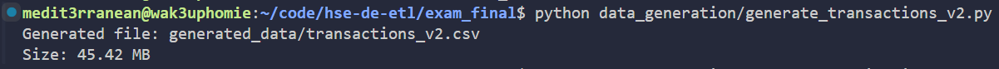

и заполнена данными (`./generated_data/transactions_v2.csv`)

| call_id             | call_time            | client_id     | region_code | campaign_type   | call_status | client_response | duration_sec | follow_up_required |
|---------------------|----------------------|---------------|-------------|-----------------|-------------|-----------------|--------------|--------------------|
| call_202605_0000000 | 2026-05-10T21:54:31Z | client_691977 | DE-HB       | cash_loan_offer | missed      | no_response     | 288          | true               |
| call_202605_0000001 | 2026-05-31T01:55:08Z | client_832997 | DE-HH       | deposit_offer   | busy        | interested      | 882          | true               |
| call_202605_0000002 | 2026-05-14T04:24:10Z | client_553517 | DE-HE       | cash_loan_offer | busy        | no_response     | 186          | true               |

Также была успешно создана база данных Managed Service for YDB, а сгенерированные данные загружены в таблицу в базу данных с помощью скрипта `./upload_transactions_to_ydb.py`
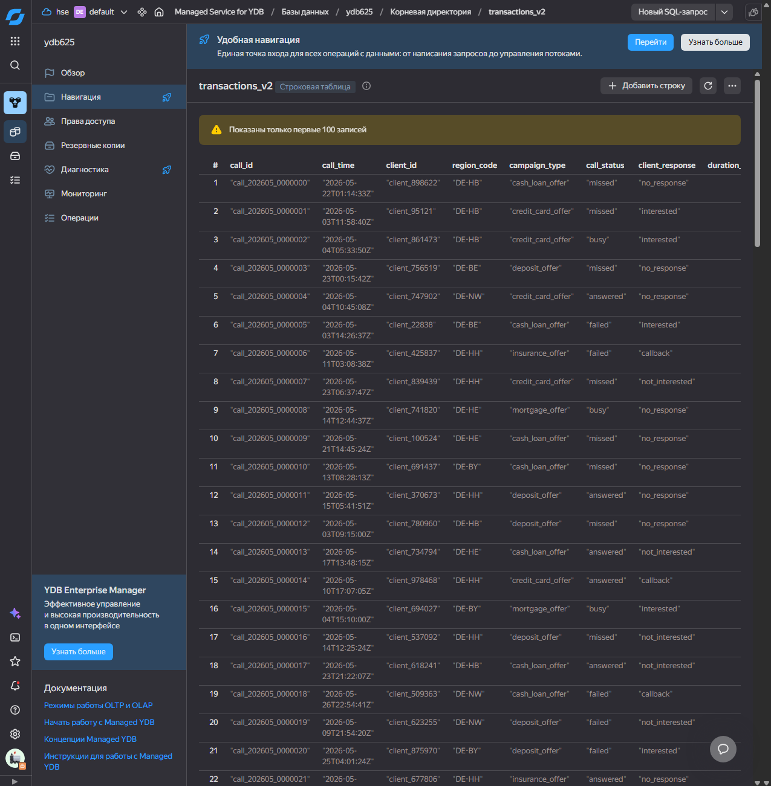

Был также успешно создан пустой бакет Object Storage, затем были созданы эндпоинты источника из БД и приёмника из бакета
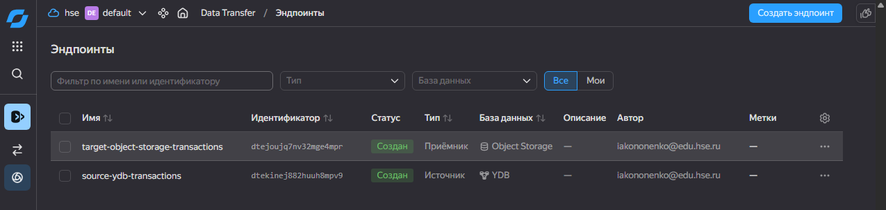

Был успешно создан и активирован трансфер копирования с новыми эндпоинтами
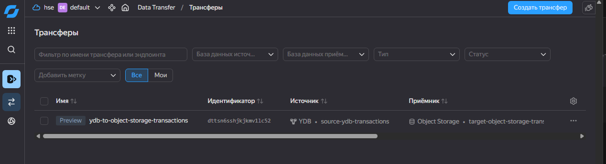

Данные успешно появились в бакете в виде CSV файла
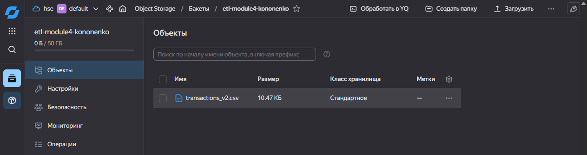

---

## Задание 2: Автоматизация работы с Yandex Data Processing при помощи Apache AirFlow

Для второго задания был подготовлен CSV-файл `applications.csv` с помощью скрипта `./data_generation/generate_applications.py`, содержащий данные о кредитных заявках. Объём файла составил более 50 Мб.
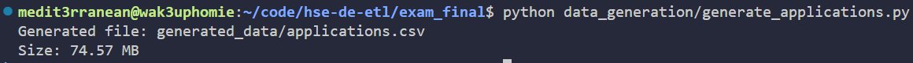

| application_id       | event_time          | customer_id | region_code | product_type | requested_amount | term_months | credit_score | risk_level | decision_status | approved_amount | channel     | employee_review_flag | processing_time_sec |
|----------------------|---------------------|-------------|-------------|--------------|------------------|-------------|--------------|------------|-----------------|-----------------|-------------|----------------------|---------------------|
| app_20260501_0000000 | 2026-05-15 00:06:15 | cust_263612 | DE-HH       | cash_loan    | 49206            | 36          | 493          | medium     | rejected        | 0               | mobile      | true                 | 45                  |
| app_20260501_0000001 | 2026-05-03 02:32:51 | cust_558506 | DE-NW       | mortgage     | 31967            | 48          | 717          | high       | manual_review   | 11540           | mobile      | false                | 159                 |
| app_20260501_0000002 | 2026-05-09 21:52:12 | cust_569264 | DE-HE       | credit_card  | 3407             | 60          | 535          | high       | rejected        | 0               | call_center | true                 | 136                 |

Файл был загружен в Object Storage по пути `s3a://etl-module4-kononenko/input/applications.csv`
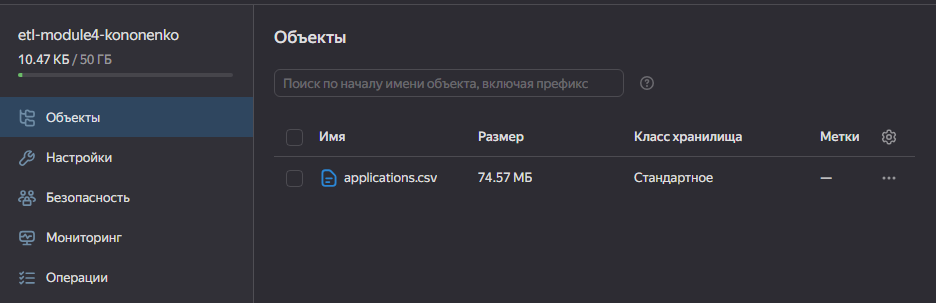

Для обработки данных было разработано PySpark-задание `pyspark/process_applications.py`. Задание выполняет чтение CSV-файла, преобразование типов и агрегацию данных по региону, продукту, статусу решения и уровню риска. Оно было загружено в бакет. Результат обработки сохраняется в Object Storage в директорию `s3a://etl-module4-kononenko/output/applications_agg`

Был создан кластер Managed Service for Apache AirFlow
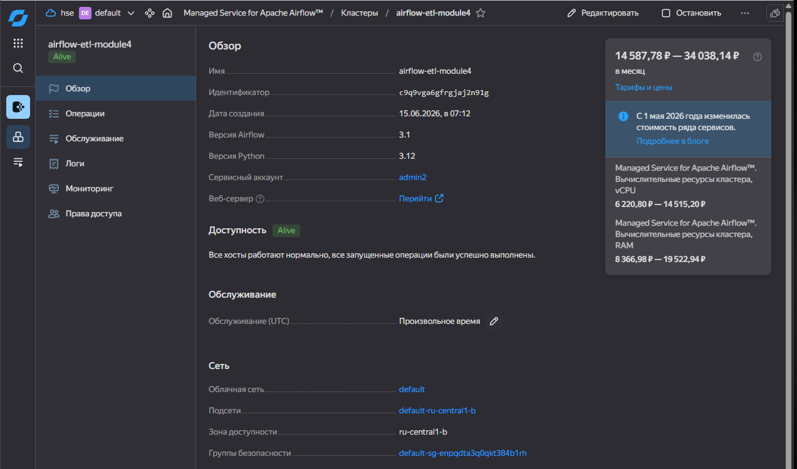

Для автоматизации процесса был подготовлен DAG Apache Airflow (`airflow/dataproc_airflow_dag.py`). DAG выполняет три последовательных шага:

1. создание временного кластера Yandex Data Processing;
2. запуск PySpark-задания;
3. удаление временного кластера после завершения обработки.

Такой подход позволяет не держать вычислительный кластер постоянно включённым и снижает расход облачных ресурсов.

В Airflow был запущен DAG, результат выполнения - успех.
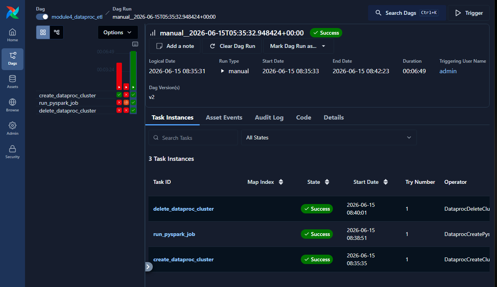

После выполнения данные появились в бакете:
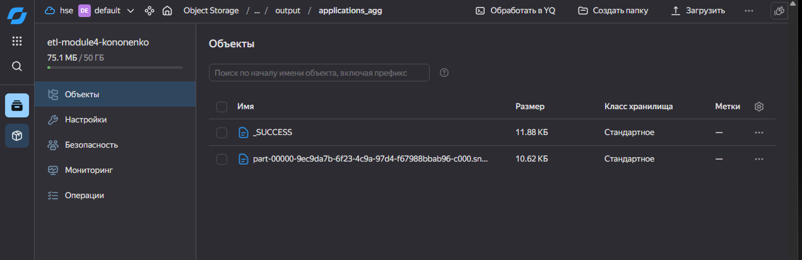

---

## Задание 3: Работа с топиками Apache Kafka с помощью PySpark-заданий в Yandex Data Processing

Для третьего задания был создан кластер Managed Service for Apache Kafka `kafka-etl-module4`. 
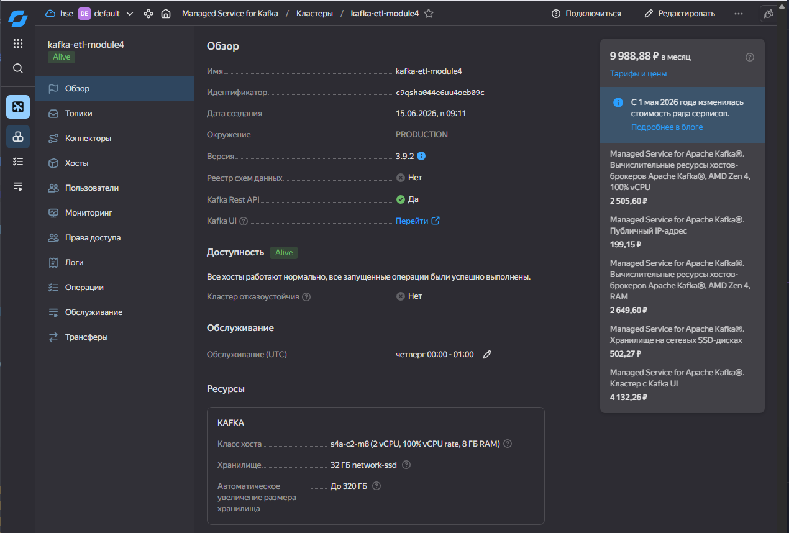
В кластере был создан topic `loan_applications`.
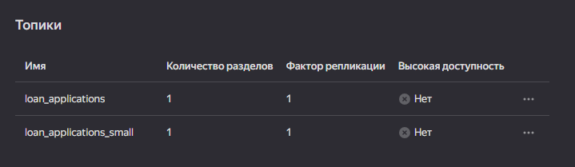
Также в кластере был создан пользователь `kafka_user`.
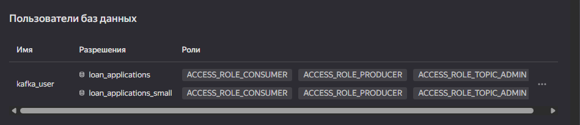

Для topic были сгенерированы скриптом `data_generation/generate_kafka_messages.py` JSON-сообщения, описывающие кредитные заявки. Каждое сообщение содержит вложенные структуры `customer`, `loan`, `scoring`, а также массив `documents`.
Общий объём отправленных сообщений составил более 20 МБ.
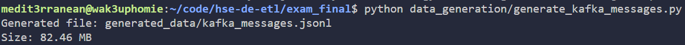

Сообщения были отправлены через kcat:
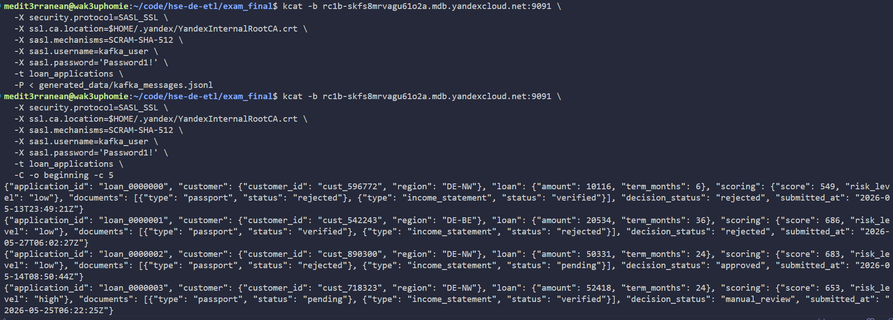

Для обработки сообщений было разработано PySpark-задание `kafka_flatten.py`. Задание читает сообщения из Kafka, преобразует поле `value` в строку, применяет JSON schema, разбирает вложенные поля и преобразует массив документов через `explode`.

В результате была получена плоская таблица со следующими полями:

- `application_id`;
- `customer_id`;
- `region_code`;
- `loan_amount`;
- `term_months`;
- `credit_score`;
- `risk_level`;
- `document_type`;
- `document_status`;
- `decision_status`;
- `submitted_at`.

Для запуска был создан DataProc кластер, в котором было запущено PySpark задание:
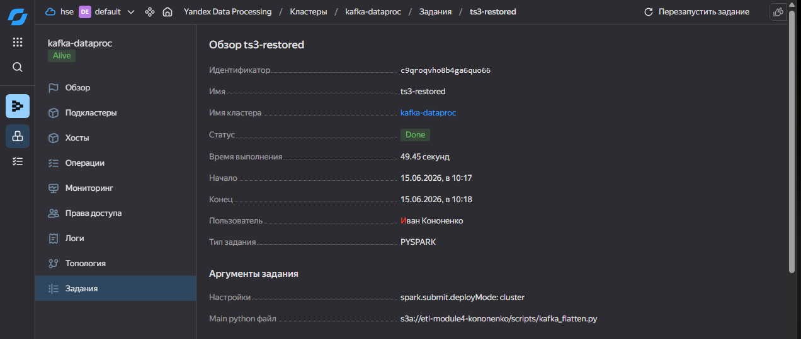

Результат был сохранён в Object Storage.
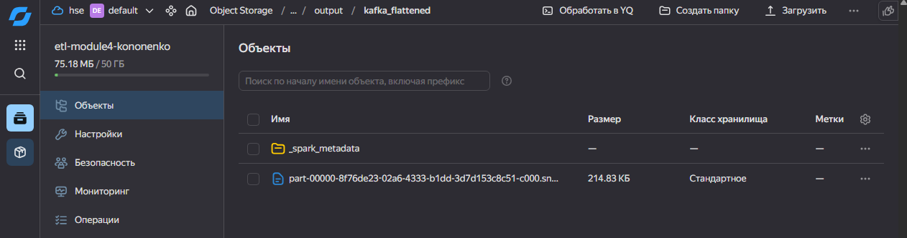

---

## Задание 4: Визуализация в DataLens

С помощью Yandex DataLens построены дашборды для визуализации полученных данных
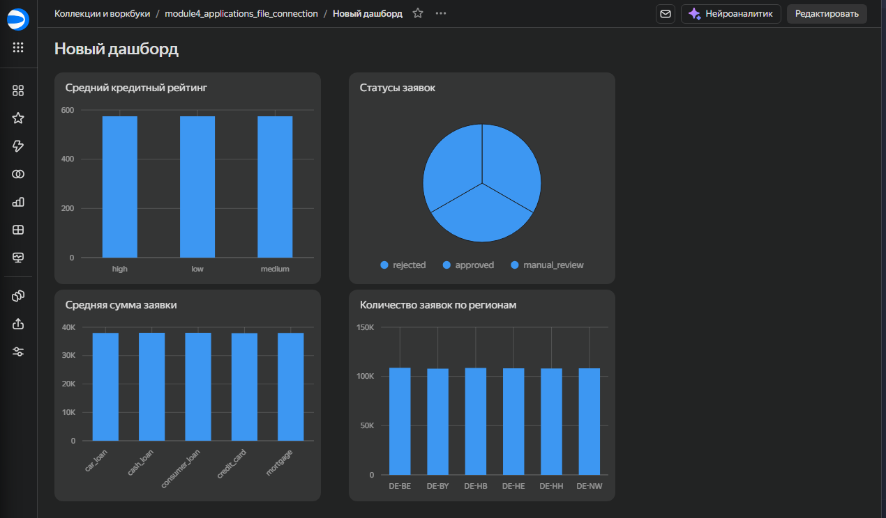