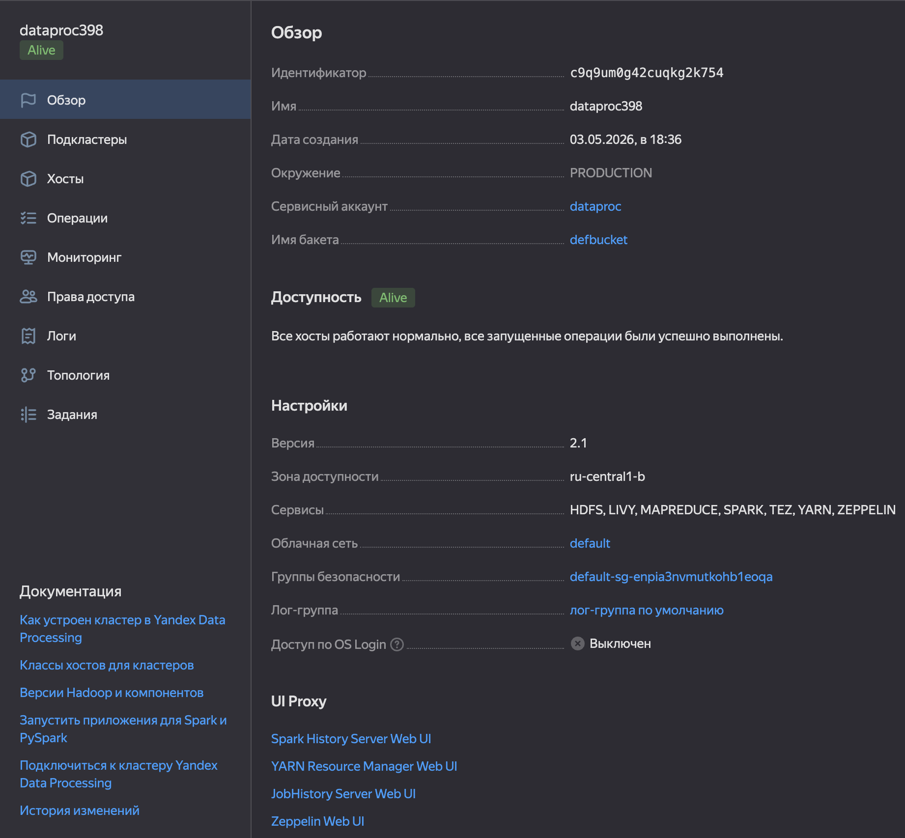
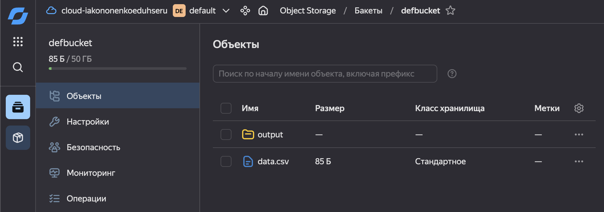
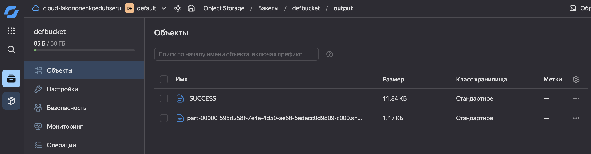
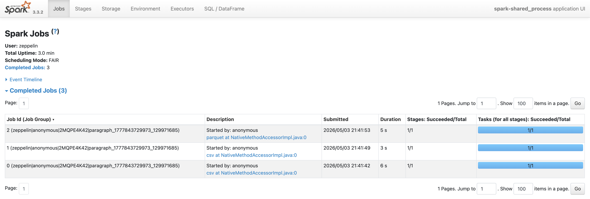
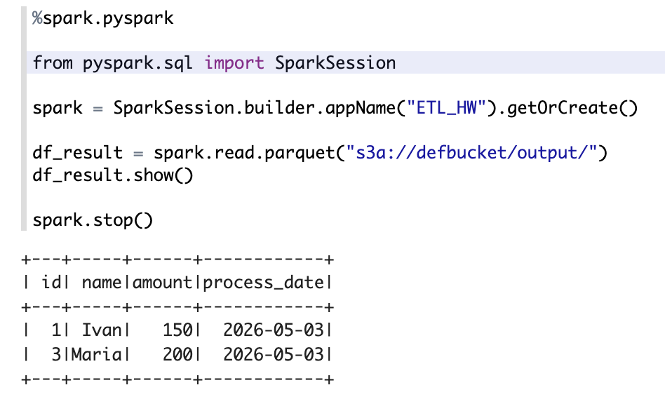
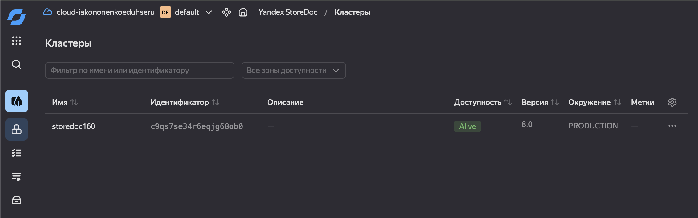

# Домашнее задание. Практическая работа

## Тема 9. Работа с big data и Тема 10. NoSQL в ETL-процессах.
## Кононенко Иван

---

## Задание 1: Работа с Big Data (Hadoop + Spark)

Был успешно создан Yandex Data Processing кластер Hadoop, Spark на платформе Yandex Cloud


В бакет в локальной сети кластера были загружены тестовые данные data.csv

| id | name  | amount | date       |
|----|-------|--------|------------|
| 1  | Ivan  | 150    | 2025-01-10 |
| 2  | Petr  | 80     | 2025-01-11 |
| 3  | Maria | 200    | 2025-01-12 |


Проведена трансформация и запись с помощью Pyspark, запущенного из Zeppelin кластера, изменённые данные успешно записаны в бакет.




Также в качестве демонстрации успешной работы скрипта ниже приложены скриншоты выполненного задания в Spark и запроса к бакету для вывода обработанных данных.



---

## Задание 2: NoSQL в ETL-процессах (Kafka → StoreDoc)

Скачаем тестовые данные со статьи

```json
{
    "device_id": "iv9a94th6rzt********",
    "datetime": "2020-06-05 17:27:00",
    "latitude": 55.70329032,
    "longitude": 37.65472196,
    "altitude": 427.5,
    "speed": 0,
    "battery_voltage": 23.5,
    "cabin_temperature": 17,
    "fuel_level": null
}
{
    "device_id": "rhibbh3y08qm********",
    "datetime": "2020-06-06 09:49:54",
    "latitude": 55.71294467,
    "longitude": 37.66542005,
    "altitude": 429.13,
    "speed": 55.5,
    "battery_voltage": null,
    "cabin_temperature": 18,
    "fuel_level": 32
}
{
    "device_id": "iv9a94th6rzt********",
    "datetime": "2020-06-07 15:00:10",
    "latitude": 55.70985913,
    "longitude": 37.62141918,
    "altitude": 417.0,
    "speed": 15.7,
    "battery_voltage": 10.3,
    "cabin_temperature": 17,
    "fuel_level": null
}
```

Далее необходимо создать два кластера, источник (Managed Service for Apache Kafka) с топиком и пользователем с нужными правами доступа, и приёмник  (StoreDoc) с необходимой базой данных




Настроим эндпоинты для источника и приёмника, а затем свяжем их трансфером


Дождёмся запуска репликации

Установим утилиты kafkacat и jq, установим нужные сертификаты безопасности и отправим данные в топик в кластер-источник:

```bash
jq -rc . sample.json | kcat -P \
   -b rc1b-08l5dhbm5sgmliml.mdb.yandexcloud.net:9091 \
   -t sensors \
   -k key \
   -X security.protocol=SASL_SSL \
   -X sasl.mechanisms=SCRAM-SHA-512 \
   -X sasl.username="mkf-user" \
   -X sasl.password="12345678" \
   -X ssl.ca.location=/usr/local/share/ca-certificates/Yandex/YandexInternalRootCA.crt -Z
```

После этого проверим наличие данных в кластере-приёмнике, подключившись к его базе данных Mongo:

```bash
mongosh --norc \
        --tls \
        --tlsCAFile ~/.mongodb/root.crt \
        --host 'rc1b-6nctr4at5l9shos8.mdb.yandexcloud.net:27018' \
        --username mmg-user \
        --password 12345678 \
        db1
```

И сделаем запрос db.sensors.find()

```json
rs01 [direct: primary] db1> db.sensors.find().pretty()
[
  {
    _id: 'iv9a94th6rzt********-2026\\-05\\-03 23:27:42.393 +0300 MSK-{"partition":2,"topic":"sensors"}-0-1',
    device_id: 'iv9a94th6rzt********',
    datetime: '2020-06-05 17:27:00',
    latitude: 55.70329032,
    longitude: 37.65472196,
    altitude: 427.5,
    speed: 0,
    battery_voltage: 23.5,
    cabin_temperature: 17,
    fuel_level: null,
    _timestamp: ISODate('2026-05-03T20:27:42.393Z'),
    _partition: '{"partition":2,"topic":"sensors"}',
    _offset: Decimal128('0'),
    _idx: Long('1')
  },
  {
    _id: 'rhibbh3y08qm********-2026\\-05\\-03 23:27:42.393 +0300 MSK-{"partition":2,"topic":"sensors"}-1-1',
    device_id: 'rhibbh3y08qm********',
    datetime: '2020-06-06 09:49:54',
    latitude: 55.71294467,
    longitude: 37.66542005,
    altitude: 429.13,
    speed: 55.5,
    battery_voltage: null,
    cabin_temperature: 18,
    fuel_level: 32,
    _timestamp: ISODate('2026-05-03T20:27:42.393Z'),
    _partition: '{"partition":2,"topic":"sensors"}',
    _offset: Decimal128('1'),
    _idx: Long('1')
  },
  {
    _id: 'iv9a94th6rzt********-2026\\-05\\-03 23:27:42.393 +0300 MSK-{"partition":2,"topic":"sensors"}-2-1',
    device_id: 'iv9a94th6rzt********',
    datetime: '2020-06-07 15:00:10',
    latitude: 55.70985913,
    longitude: 37.62141918,
    altitude: 417,
    speed: 15.7,
    battery_voltage: 10.3,
    cabin_temperature: 17,
    fuel_level: null,
    _timestamp: ISODate('2026-05-03T20:27:42.393Z'),
    _partition: '{"partition":2,"topic":"sensors"}',
    _offset: Decimal128('2'),
    _idx: Long('1')
  }
]
```

Как видно, данные на месте, трансфер работоспособен