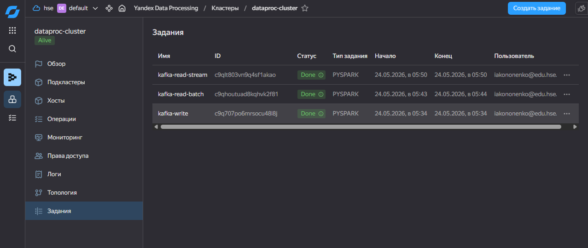
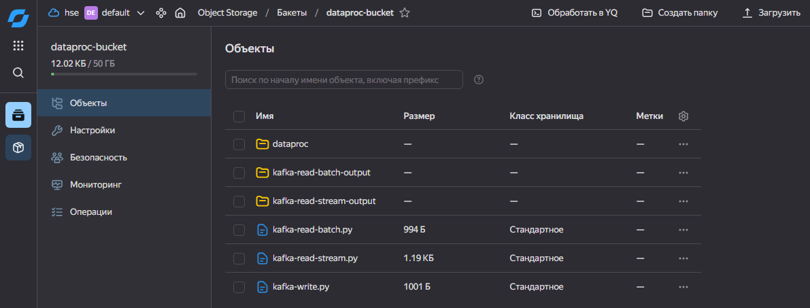

# Домашнее задание. Практическая работа

## Тема 13. Потоковая обработка данных
## Кононенко Иван

---

## Задание: Запишите сообщения в топик Apache Kafka® и прочитайте сообщения из топика с помощью PySpark-задания

1. Была создана облачная сеть.
2. Была создана подсеть.
3. Был создан NAT-шлюз для подсети.
4. Была создана группа безопасности в сети.
5. Была настроена группа безопасности.
6. Был создан сервисный аккаунт с ролями.
7. Был создан кластер Yandex Data Processing.
8. Был создан кластер Managed Service for Apache Kafka.
9. Был создан топик Apache Kafka.
10. Был создан пользователь Apache Kafka.
11. Были загружены скрипты в бакет.
12. Были созданы и запущены задания PySpark с этими скриптами.



Все задания отработали правильно, в бакет попали итоговые файлы, в которых содержится тестовое сообщение:



**part-00000-2c47cb3c-38dd-452f-aee4-6fb617c283e1-c000.txt**
```
{"msg":"Test message #1 from dataproc-cluster"}
```
**part-00000-a094ef27-edc7-4ffe-b372-1ec466af632a-c000.txt**
```
{"msg":"Test message #1 from dataproc-cluster"}
{"msg":"Test message #2 from dataproc-cluster"}
```
**part-00001-2c47cb3c-38dd-452f-aee4-6fb617c283e1-c000.txt**
```
{"msg":"Test message #2 from dataproc-cluster"}
```