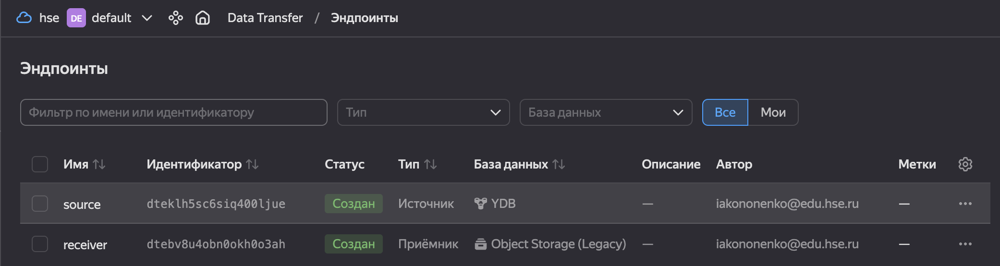
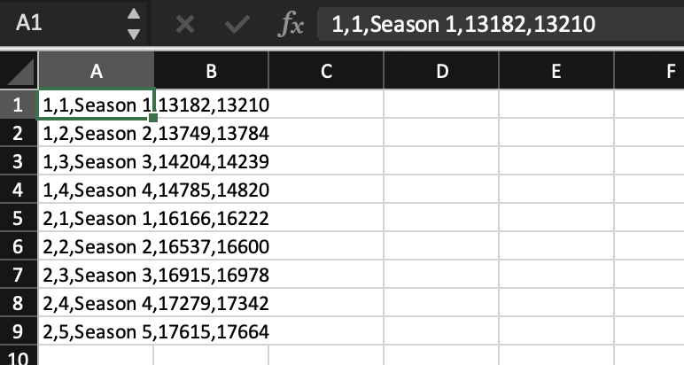
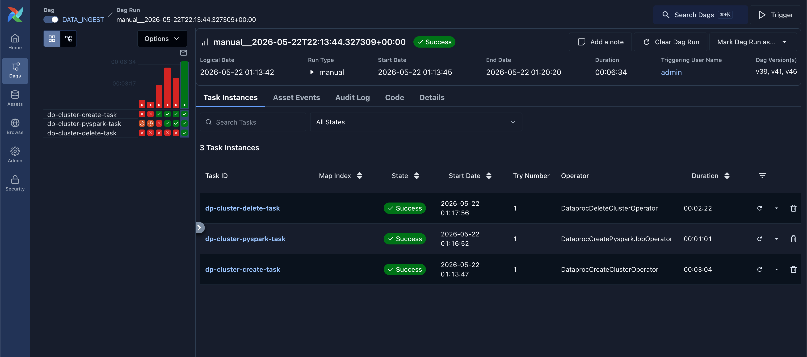
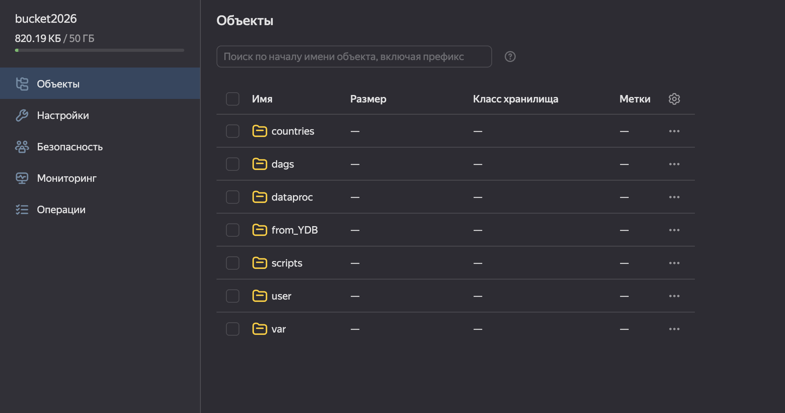

# Домашнее задание. Практическая работа

## Тема 11. Хранение данных в облаке, Тема 12. Работа с облачными вычислениями
## Кононенко Иван

---

## Задание 1: Перенос базы данных из Yandex Managed Service for PostgreSQL в Yandex Object Storage с помощью сервиса Yandex Data Transfer

Была успешно создана база данных Managed Service for YDB, создана таблица и заполнена данными

Был успешно создан бакет Object Storage 

Были успешно созданы эндпоинты источника и приёмника

Был успешно создан и активирован трансфер копирования с новыми эндпоинтами

Данные успешно появились в бакете в виде CSV файла

---

## Задание 2: Обработайте данные из Yandex Object Storage с помощью сервиса Apache AirFlow, используя мощности Yandex Data Processing.

По инструкции создадим бакет, кластер Hive Metastore, кластер Airflow, добавим DAG из инструкции в бакет и запустим его в веб-интерфейсе Airflow, заполнив нужные данные для подключения

При этом в бакете успешно появились результаты выполнения
